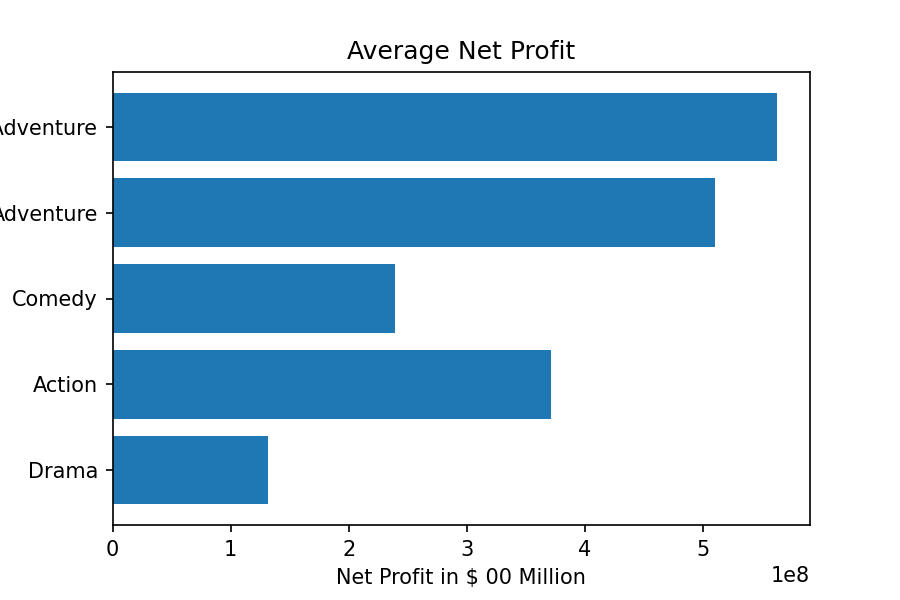
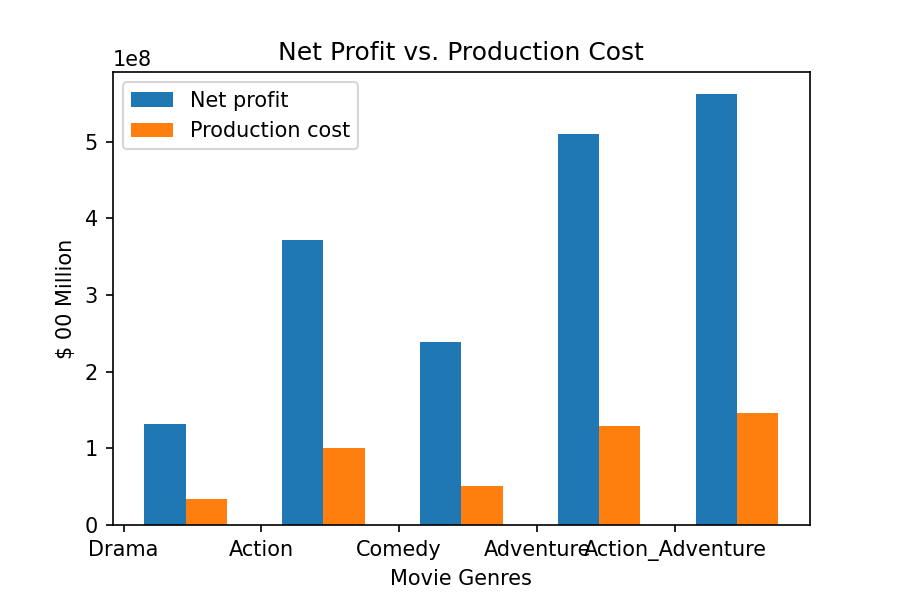
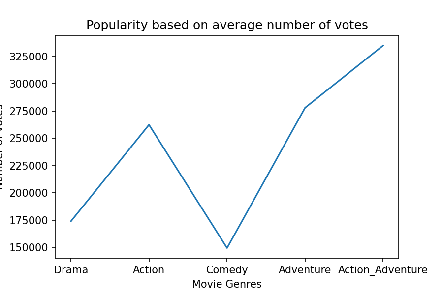
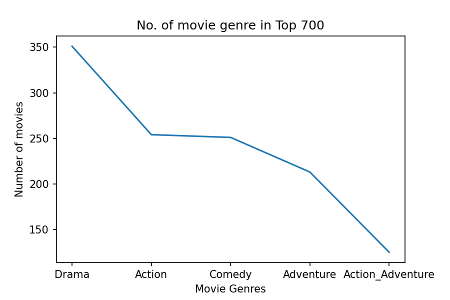

# Insights and Analysis for Microsoft's New Movie Studio 

**Author:** Yessy Rayner
***

## Overview

This project analyses the trend and popularity as well as profitability of Top 5 movie genres. We will use exploratory data analysis to generate actionable insights and recommendations for the head of Microsoft's new movie studio.

## Business Problem

Microsoft sees all the big companies creating their own original video content and would like to get into the business by creating their own movie studio. However they don’t have any experience in producing movies. Therefore, this project will explore types/genres of movies that are currently doing the best at the box office and translate those findings into actionable insights that Microsoft's new movie studio can use to help decide what type of movies to produce.

## Data Understanding

For this project, I will be using two data sets from IMDb. IMDb is a popular online databases of information related to films, TV and more. The datas that I use are based on the movies produced from 2010 to 2019, we are not using the datas from 2020-2021 due to COVID-19 pandemic which might skewed the findings as movies weren't doing well during the pandemic. The two IMDb datas will be merged in order to yield for Top Rated movies. Top rates movies can be used to measure popularity and longetivity. And have the potential of residual income down the track such as franchise potential, DVD, merchandise and online streaming etc.

We will also explore datas from The-Numbers movie budget (tn_movie_budgets) which contain production budget/cost. The reason that I use this data is due to some movies seems to do well in the box office, however due to high production cost, some movies made a big loss, for example Dark Phoenix (2019) which made a total loss of $157M (We will come across this later during data preparation in this project).

## Methods

In this section, I will be merging 2x IMDb datasets first, in case these datas need analysing prior merging with tn_movie_budgets. All 3 datasets have different amount of value attached to it, but the main goal is to see which genres made the most net profit (gross profits less production cost), as well as the most popular based on the highest amount of votes and rating above 6. 

Therefore at the end of this process, I will be dropping the following:

1. Datas that has less than 20,000 votes and rating under 6.0
2. Datas that are missing genre and production cost
3. Duplicated datas, which I came across at the later stage of this Data Preparation process

## Results

### Most Profitable Genre

From the analysis conducted above and graph below, Action & Adventure genre yields the most average net profit at $509M, followed by Adventure, Action, Comedy and Drama.



### Production Cost Insights

Although Action & Adventure genre yields the most profit, but it also cost the most to produce at 145M, comparing to Drama genre only cost 34M in production (Approx. 76% cost less comparing to Action & Adventure genres). See graphs below for more insights.



### Popularity based on number of votes

The popularity is consistent with the net profit with Action & Adventure genres are getting the most votes, comparing to the rest of the genres.



### Number of Genres Made it to Top 700

Drama made the highest genre in my Top 700 findings with 351 movies are listed under drama, compared to 125 movies listed under Action & Adventure.

Although Drama made the less profit in my Top 5 Genres, nonetheless it is still making a whopping $131M on average in profit per movie. With the highest number of movies fall under Drama, it is proven that this genre is more consistent in making profit. 

Only 125 movies fall under Action & Adventure genres, this genre is a high risk investment due to huge production cost and possibility of making losses. For examples, Dark Phoenix, MIB: International, and Renegades made 157M, 103M and 75M losses respectively. However when this genre is done right and produced properly, it will yield the most profit.



## Conclusions

This analysis leads to three recommendations for Microsoft's new movie studio:

- Depending on production budget, I recommend to invest in Drama and/or Comedy. These two genres are low risk investment, cost less to produce but yield consistent profit.
- It is best to target both domestic and international audiences in order to get maximum profit.
- If budget allowed, do consider investing in Action & Adventure genres due to its highest profit and popularity. However further research are a must on writer, producer, director and cast.

## Next Steps

Further analyses could yield additional insights to maximise profitability and popularity of the movies produced by Microsoft's new movie studio:

- Due to datas were based 2010-2019, I suggest to analyse similar datas for 2022 at the end of this year to see if there are any changes on trends and further findings.
- Further research are required in term of cast, producer, director, writer, and crew on whatever genres that Microsoft's new studio decided to produce, as it will affect the profitability.
- Research on the movies that made losses in the past 10 years and learn how to avoid those losses.

## For More Information

See the full analysis in the [Jupyter Notebook](./Yessy_Project1.ipynb)

For additional info, contact Yessy Rayner at [yessy.rayner@gmail.com](mailto:yessy.rayner@gmail.com)


## Repository Structure

```
├── images
├── README.md
├── Yessy_Project1 - Presentation.pdf
├── Yessy_Project1.ipynb
├── imdb.title.basics.csv.gz
├── imdb.title.ratings.csv.gz
└── tn.movie_budgets.csv.gz


